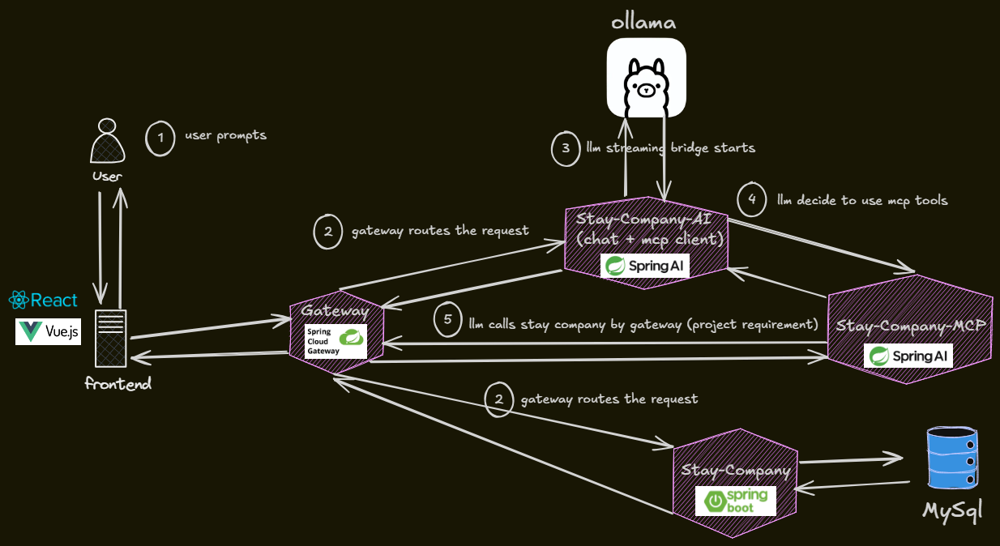

# StayCompany AI Chat Agent

## 📦 Deliverables
- **Project Video**: [https://drive.google.com/file/d/1hr-xMYcTv_puflVY59wkyvkCoUYcmyHr/view?usp=sharing](https://drive.google.com/file/d/1hr-xMYcTv_puflVY59wkyvkCoUYcmyHr/view?usp=sharing)
---
- **Chat + Mcp Client Source Code**: [https://github.com/cansugunn/stay-company-ai](https://github.com/cansugunn/stay-company-ai)
- **Mcp Server Source Code**: [https://github.com/cansugunn/stay-company-mcp-server](https://github.com/cansugunn/stay-company-mcp-server)
- **Frontend Source Code**: [https://github.com/cansugunn/stay-company-chat-ui](https://github.com/cansugunn/stay-company-chat-ui)
---
- **Updated Gateway Source Code**: [https://github.com/cansugunn/stay-company-gateway](https://github.com/cansugunn/stay-company-gateway)
- **Updated Stay Company Source Code**: [https://github.com/cansugunn/stay-company](https://github.com/cansugunn/stay-company)

## 🚀 Overview

StayCompany AI is a sophisticated AI-driven chat platform designed to enhance the user experience for stay management. Built with a modular architecture, it integrates a reactive frontend with a robust backend AI controller and a specialized MCP (Model Context Protocol) server to facilitate real-time interactions and tool executions.

## 🏗️ Expected Architecture

The system follows a distributed architecture designed for scalability and real-time responsiveness:

*   **Frontend**: Built with modern web technologies using a reactive framework, providing a seamless chat interface.
*   **AI Backend (`stay-company-ai`)**: Acts as the chat controller, managingconversation state and streaming responses via **Server-Sent Events (SSE)**.
*   **MCP Server (`stay-company-mcp`)**: Implements the Model Context Protocol to provide the LLM with specialized tools for stay-related operations.
*   **API Gateway**: All API calls are routed through a central gateway to ensure consistent security and rate limiting.
*   **Midterm APIs**: Core business services for listings, stays, reviews, and user management.

## 🛠️ Technical Implementation

### AI Controller (`stay-company-ai`)
The AI backend is the heart of the chat system. It utilizes **Spring AI** to communicate with the LLM (Ollama) and manages the tool-calling flow.
- **SSE Streaming**: Responses are streamed to the frontend in real-time using `Flux<ServerSentEvent<String>>`, ensuring a responsive user experience.
- **JWT Context**: Authentication is handled via JWT. The controller passes the user's token as context to the MCP tools, allowing for secure, personalized actions without exposing sensitive data in the LLM prompt.

### MCP Tools (`stay-company-mcp`)
The MCP server provides dedicated tools that the LLM can invoke:
*   `query listings`: Search for available accommodations.
*   `book a listing`: Create a new stay.
*   `review a listing`: Submit user feedback.

#### Key Enhancements:
- **Review Upsert**: Implemented an upsert logic in the review service. If a review already exists for a stay, it is updated rather than duplicated, allowing users to persist and refine their suggestions.
- **Listing Title Filtering**: The pagination service now supports title-based filtering. The MCP server uses a wrapper method to obtain the most relevant matching ID, as the core services expect IDs rather than human-readable names.
- **City Identity Resolution**: Added name filtering to city pagination. This allows the LLM to provide a city name (e.g., "Paris"), which the MCP server resolves to a `cityId` required by the listing service.
- **Identity Awareness**: If a guest name list is not provided during booking, the system automatically retrieves the user's identity (Firstname/Lastname) using the provided JWT token.

## 🔐 Security & Identity
Security is a primary concern in StayCompany AI:
- **Privacy-First Tokens**: JWT tokens are intentionally designed **not** to store first and last names to minimize data exposure.
- **Identity Retrieval**: When the MCP server requires user information, it uses the JWT token obtained from the MCP client to call the `stay-company` news (user) endpoint. This retrieves the necessary profile details directly from the database and core service, ensuring data integrity and security.

## 🤖 LLM Strategy: Ollama & Local LLM
To ensure privacy and avoid the token limitations often encountered with cloud LLM providers, we utilize **Ollama** with a lightweight model (e.g., Mistral or Llama-3).
- **Privacy**: All processing happens locally.
- **No Deployment**: As a local LLM is used, the project is designed for local execution and does not require deployment to a cloud app service.

## ⚠️ Challenges & Decisions

### Frontend & LLM Determinism
During development, we attempted to implement a highly structured UI (as seen in the PDF designs) featuring custom DTO rendering for listings and stays. 
- **The Issue**: Local LLMs often struggle with strict deterministic output formats. When prompted to return structured JSON alongside conversational text, we observed:
    - Significant latency spikes (>60s).
    - High error rates (~40%) in JSON parsing.
- **The Decision**: For stability, we maintained the conversational output. The `SYSTEM_PROMPT` and `WrapperResultDto` remain in the codebase as proof of the attempted architecture, but are currently bypassed in the frontend to ensure a smooth user experience.

### Gateway & Rate Limiting
The project respects the architectural requirement that all calls must pass through the API Gateway.
- **Constraint**: Current rate limiter settings are restrictive (defaulting to 3 calls per day).
- **Recommendation**: In a production environment, we suggest:
    1.  Bypassing MCP tool calls from the standard rate limiter.
    2.  Utilizing internal service-to-service communication to avoid Gateway overhead for trusted components.